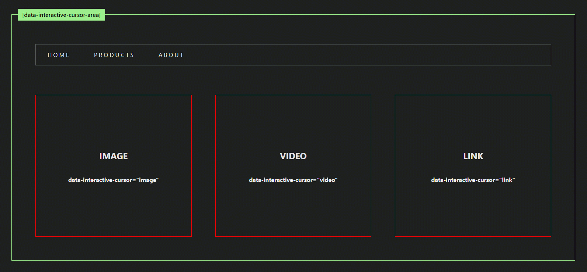

# InteractiveCursor Component

The `InteractiveCursor` is a Svelte 5 component that provides a customizable, interactive cursor effect. It dynamically changes its position and size based on user interactions within specified trigger areas. This component is ideal for enhancing user experiences with visually engaging cursor animations.

### [Live Demo](https://lostis-world.github.io/svelte-interactive-cursor/)

[CHANGELOG](./CHANGELOG.md)



---

## Installation

You can install the `InteractiveCursor` component using npm or pnpm:

### Using npm

```bash
npm install @lostisworld/svelte-interactive-cursor
```

### Using pnpm

```bash
pnpm add @lostisworld/svelte-interactive-cursor
```

---

## Features

1. **Dynamic Resizing**: The cursor adjusts its size and position dynamically when hovering over elements specified in the `useDataElementRect` property.
2. **Scaling on Interaction**: Scale transformations can be applied to the cursor when hovering over specified elements using `scaleOnActive`.
3. **Animation Control**: Smooth animations with customizable duration using CSS transitions and `KeyframeAnimationOptions`.
4. **Custom Icons**: Allows custom rendering inside the cursor element using the `children` property.
5. **State Exposure**: Exposes `activeDataValue` to track the active interactive element and its name dynamically.
6. **Responsive Design**: Automatically disables the interactive cursor for small screens or when reduced motion is preferred.

---

### Types

#### `ScaleOnActiveElement`

```ts
type ScaleOnActiveElement = {
	element: string; // The name of the element (value of `data-interactive-cursor`).
	scaleMultiplicator?: number; // Scale factor to apply when the element is active.
};
```

#### `InteractiveCursorOptions`

```ts
interface InteractiveCursorOptions {
	defaultSize?: number; // Default cursor size in pixels.
	scaleOnActive?: ScaleOnActiveElement[]; // Elements with scale factors.
	duration?: number; // Animation duration in milliseconds.
	useDataElementRect?: string[]; // Elements that trigger cursor resizing.
}
```

---

## Usage

### Basic Setup

Import the `InteractiveCursor` component and include it in your Svelte application:

```svelte
<script lang="ts">
	import InteractiveCursor from '@lostisworld/svelte-interactive-cursor';
</script>

<div data-interactive-cursor-area>
	<button data-interactive-cursor="btn">Hover me!</button>
</div>

<InteractiveCursor
	defaultSize={40}
	duration={300}
	scaleOnActive={[{ element: 'btn', scaleMultiplicator: 2 }]}
	useDataElementRect={['btn']}
/>
```

### Advanced Example

Here is an example with custom cursor behavior and styles:

```svelte
<script lang="ts">
	import InteractiveCursor from '@lostisworld/svelte-interactive-cursor';

	let currentCursorState = $state({ activeDataName: '', activeDataElement: null });

	// Custom cursor props
	const scaleOnActive: ScaleOnActiveElement[] = [
		{ element: 'image' },
		{ element: 'video', scaleMultiplicator: 4 },
		{ element: 'link' },
		{ element: 'mixblend', scaleMultiplicator: 8 },
		{ element: 'prevslide', scaleMultiplicator: 5 },
		{ element: 'nextslide', scaleMultiplicator: 5 }
	];

	const customCursorProps = [
		{ data: 'image', icon: '<svg>...</svg>' },
		{ data: 'video', icon: '<svg>...</svg>', cursorClass: 'bg-red-500 text-white' },
		{ data: 'link', icon: '<svg>...</svg>', cursorClass: 'bg-sky-500 text-white' },
		{ data: 'tablist', cursorClass: 'rounded-none outline outline-2 outline-purple-500' }
	];
</script>

<div>
	<!-- Interactive Cursor Target Areas -->
	<section data-interactive-cursor-area>
		<div data-interactive-cursor="image">Image</div>
		<div data-interactive-cursor="video">Video</div>
		<div data-interactive-cursor="link">Link</div>
		<ul data-interactive-cursor="tablist">
			<li>Tab 1</li>
			<li>Tab 2</li>
		</ul>
	</section>

	<!-- Interactive Cursor Component -->
	<InteractiveCursor
		bind:activeDataValue={currentCursorState}
		{scaleOnActive}
		useDataElementRect={['tablist']}
		class="rounded-full flex items-center justify-center {currentCursorState.activeDataName === ''
			? 'bg-white text-black'
			: customCursorProps.find((state) => state.data === currentCursorState.activeDataName)
					?.cursorClass || 'bg-white text-black'}"
	>
		{#each customCursorProps as { icon, data }}
			{#if data === currentCursorState.activeDataName && icon}
				{@html icon}
			{/if}
		{/each}
	</InteractiveCursor>
</div>
```

---

## Component Props

| **Property**         | **Type**                                                     | **Default**                                       | **Description**                                                                                                                                |
| -------------------- | ------------------------------------------------------------ | ------------------------------------------------- | ---------------------------------------------------------------------------------------------------------------------------------------------- |
| `defaultSize`        | `number`                                                     | `32`                                              | The default size (in pixels) of the cursor.                                                                                                    |
| `scaleOnActive`      | `ScaleOnActiveElement[]`                                     | `[]`                                              | Array of objects specifying elements and their respective scaling factors.                                                                     |
| `duration`           | `number`                                                     | `500`                                             | Duration of the cursor's animation in milliseconds.                                                                                            |
| `useDataElementRect` | `string[]`                                                   | `[]`                                              | Array of element names (matched by `data-interactive-cursor`) for which the cursor dynamically resizes and aligns to their bounding rectangle. |
| `class`              | `string`                                                     | `''`                                              | Additional classes to apply to the cursor element.                                                                                             |
| `children`           | `Snippet`                                                    | `undefined`                                       | Custom content to render inside the cursor.                                                                                                    |
| `activeDataValue`    | `{ activeDataName: string; activeDataElement: HTMLElement }` | `{ activeDataName: '', activeDataElement: null }` | Tracks the currently active interactive element's name and DOM reference.                                                                      |

---

## Data Attributes

### Cursor Areas

- Add `data-interactive-cursor-area` to define areas where the cursor can interact.
- Add `data-interactive-cursor="value"` to target specific elements and associate them with custom cursor behaviors.

Example:

```html
<div data-interactive-cursor-area>
	<div data-interactive-cursor="image">Image Element</div>
	<div data-interactive-cursor="video">Video Element</div>
</div>
```

---

## Styling

The `InteractiveCursor` component includes default styles that can be customized using the `class` prop or overriding CSS variables.

### Default Classes

- `.lw-interactive-cursor`: Base cursor styles.
- `.lw-interactive-cursor.active`: Active state styles.

### Example Custom Styles

```css
.lw-interactive-cursor {
	background-color: white;
	color: black;
}
.lw-interactive-cursor.active {
	background-color: blue;
	color: white;
}
```

---

## API for `interactiveCursor` (Module)

If you need more control over the cursor logic, use the `interactiveCursor` module directly.

### Function Signature

```ts
interactiveCursor(
	cursor: HTMLElement,
	options: InteractiveCursorOptions
): InitiaCursor
```

### `InteractiveCursorOptions`

| Option                    | Type       | Default | Description                                                                                    |
| ------------------------- | ---------- | ------- | ---------------------------------------------------------------------------------------------- |
| `defaultSize`             | `number`   | `32`    | Default cursor size in pixels.                                                                 |
| `activeSizeMultiplicator` | `number`   | `3`     | Scale multiplier for active state.                                                             |
| `duration`                | `number`   | `500`   | Animation duration in milliseconds.                                                            |
| `useDataElementRect`      | `string[]` | `[]`    | Specifies elements (by `data-interactive-cursor`) that should adjust cursor size and position. |

---

## Events and Methods

### Properties

- `isActive`: Boolean indicating whether the cursor is currently active.
- `activeDataValue`: Tracks the current `data-interactive-cursor` name and element.

### Methods

- `init()`: Initializes event listeners and cursor tracking.
- `destroy()`: Cleans up event listeners and animations.

---

## Notes

- The component is disabled for devices with a screen width less than `1024px` or if `prefers-reduced-motion` is enabled.
- Always ensure the `data-interactive-cursor-area` attribute is present on interactive parent elements.

This documentation provides clear guidance on integrating and customizing the `InteractiveCursor` component for a variety of use cases. Let me know if you'd like further refinements!

---

## Contributing

Contributions are welcome! Please ensure all changes are well-documented and tested.

1. Fork the repository.
2. Create a new branch for your feature or bugfix.
3. Commit your changes with clear and descriptive messages.
4. Submit a pull request.

---

## License

This project is licensed under the [MIT License](https://github.com/LoStis-World/svelte-interactive-cursor/blob/main/LICENCE).

Here’s the updated documentation for your `InteractiveCursor` component based on the provided code:
