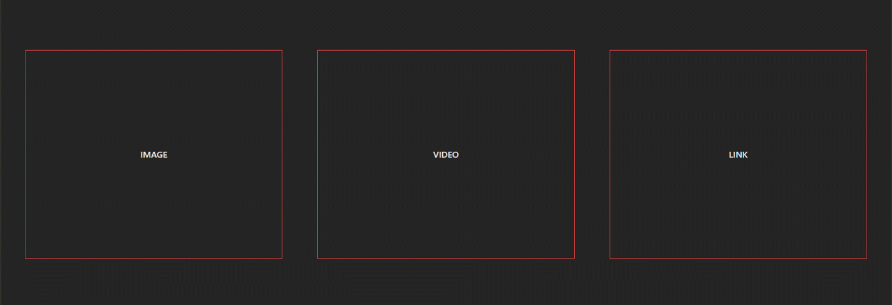

# InteractiveCursor Component Documentation

The `InteractiveCursor` is a Svelte component that provides a customizable and interactive cursor experience. It dynamically updates its appearance based on defined interactive states and responds to user interactions in specified trigger areas.

### [Live Demo](https://www.sveltelab.dev/m05yzddedf6gqkt)



---

## Installation

You can install the `InteractiveCursor` component using npm or pnpm:

### Using npm

```bash
npm install @lostisworld/svelte-interactive-cursor
```

### Using pnpm

```bash
pnpm add @lostisworld/svelte-interactive-cursor
```

---

## Features

- **Interactive States**: Supports different cursor styles based on data attributes.
- **Customizable Appearance**: Adjust the size, duration, classes, and interactive state icons.
- **Trigger Areas**: Define specific elements or selectors where the cursor's interactive behavior is active.
- **Seamless Animation**: Smooth transitions with configurable animation duration.

---

## Props

### `InteractiveCursorProps`

| Prop Name                 | Type                          | Default     | Description                                                                     |
| ------------------------- | ----------------------------- | ----------- | ------------------------------------------------------------------------------- |
| `class`                   | `string`                      | `undefined` | Additional CSS classes for the cursor container.                                |
| `setInteractiveState`     | `interactiveStateItem[]`      | `[]`        | Custom interactive states that define the cursor's appearance and behavior.     |
| `duration`                | `number`                      | `500`       | Duration of the cursor's animation in milliseconds.                             |
| `defaultSize`             | `number`                      | `32`        | Default size of the cursor in pixels.                                           |
| `activeSizeMultiplicator` | `number`                      | `3`         | Size multiplier for the cursor when it is active.                               |
| `triggerAreas`            | `string[]` or `HTMLElement[]` | `required`  | Array of CSS selectors or DOM elements where the interactive cursor is enabled. |

---

## Types

### `interactiveStateItem`

| Property      | Type                        | Description                                                      |
| ------------- | --------------------------- | ---------------------------------------------------------------- |
| `data`        | `string`                    | Defines the type of interaction (e.g., link, image, video).      |
| `icon`        | `IconName` or `HTMLElement` | Icon or custom HTML element displayed when this state is active. |
| `iconClass`   | `string`                    | Additional classes for the icon.                                 |
| `cursorClass` | `string`                    | Additional classes for the cursor.                               |

---

## Default Interactive States

The component comes with the following pre-configured interactive states:

1. **Link**: `data: 'link'`, icon: `heroicons - arrow-up-right`
2. **Image**: `data: 'image'`, icon: `heroicons - photo`
3. **Video**: `data: 'video'`, icon: `heroicons - video-camera`

These defaults can be overridden by providing a custom `setInteractiveState` array.

---

## Example Usage

Here’s an example of how to use the `InteractiveCursor` component in a Svelte project:

### Setup

1. Install and import the `InteractiveCursor` component.

```html
<script lang="ts">
	import InteractiveCursor, {
		type InteractiveCursorProps,
		type interactiveStateItem
	} from './interactive-cursor.svelte';

	// Define custom interactive states
	const customStates: interactiveStateItem[] = [
		{ data: 'link', icon: 'Link', cursorClass: 'bg-blue-500' },
		{ data: 'button', icon: 'Button', cursorClass: 'bg-red-500' }
	];

	const triggerAreas = ['.interactive-area'];
</script>
```

### Add Component

```html
<InteractiveCursor
	class="my-custom-cursor"
	duration="{400}"
	defaultSize="{40}"
	activeSizeMultiplicator="{2.5}"
	setInteractiveState="{customStates}"
	{triggerAreas}
/>
```

### HTML Structure

Add `data-interactive-cursor` attributes to elements within the `triggerAreas`:

```html
<div class="interactive-area">
	<a href="#" data-interactive-cursor="link">Interactive Link</a>
	<button data-interactive-cursor="button">Interactive Button</button>
</div>
```

### Styling

Customize the appearance using the provided classes or by overriding the styles:

```css
.my-custom-cursor {
	background-color: rgba(0, 0, 0, 0.8);
	color: white;
}
```

---

## Notes

- Ensure that `triggerAreas` corresponds to valid selectors or existing DOM elements.
- Use the `data-interactive-cursor` attribute on elements to map them to specific interactive states.
- The component respects user preferences for reduced motion when applicable.

---

This documentation provides a complete overview of the `InteractiveCursor` component, making it easy to integrate and customize in your Svelte projects.

Everything inside `src/lib` is part of your library, everything inside `src/routes` can be used as a showcase or preview app.

## Building

To build your library:

```bash
npm run package
```
