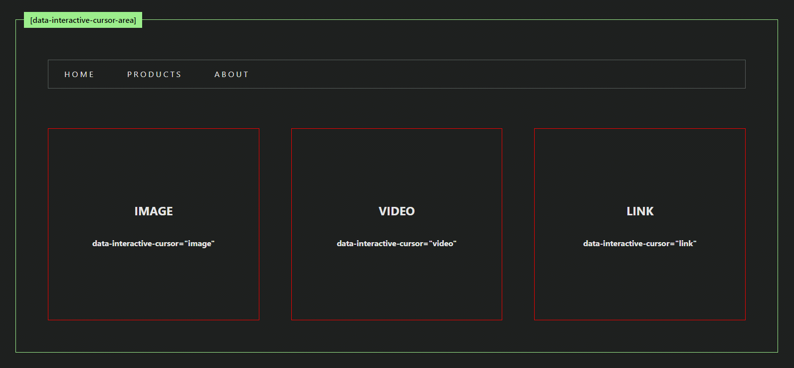

# InteractiveCursor Component

The `InteractiveCursor` is a Svelte 5 component that provides a customizable, interactive cursor effect. It dynamically changes its position and size based on user interactions within specified trigger areas. This component is ideal for enhancing user experiences with visually engaging cursor animations.

### [Live Demo](https://lostis-world.github.io/svelte-interactive-cursor/)

[CHANGELOG](./CHANGELOG.md)



---

## Installation

```bash
# npm
npm install @lostisworld/svelte-interactive-cursor

# pnpm
pnpm add @lostisworld/svelte-interactive-cursor
```

---

## Features

1. **Dynamic Resizing**: The cursor adjusts its size and position dynamically when hovering over elements specified in the `useDataElementRect` property.
2. **Scaling on Interaction**: Scale transformations can be applied to the cursor when hovering over specified elements using `scaleOnActive`.
3. **Animation Control**: Smooth animations with customizable `duration` and `easing` using the Web Animations API.
4. **Custom Icons**: Allows custom rendering inside the cursor element using the `children` snippet.
5. **State Exposure**: Exposes `activeDataValue` and `isActive` as bindable props to track cursor state in the parent.
6. **Responsive Design**: Automatically disables the interactive cursor below a configurable `breakpoint` or when reduced motion is preferred.
7. **Reduced Motion**: Dynamically responds to OS-level reduced motion changes mid-session — no page reload required.
8. **Hide Native Cursor**: Optionally hides the OS cursor inside trigger areas via `hideNativeCursor`.
9. **Performance**: Animations are throttled to one per frame via `requestAnimationFrame`, layout reads are cached, and the module is loaded only once across all instances.

---

## Types

### `ScaleOnActiveElement`

```ts
type ScaleOnActiveElement = {
element: string;             // The name of the element (value of `data-interactive-cursor`).
scaleMultiplicator?: number; // Scale factor to apply when the element is active. Default: 3.
};
```

### `InteractiveCursorOptions`

```ts
interface InteractiveCursorOptions {
defaultSize?: number;                  // Default cursor size in pixels. Default: 32.
scaleOnActive?: ScaleOnActiveElement[]; // Elements with scale factors. Default: [].
duration?: number;                     // Animation duration in milliseconds. Default: 500.
easing?: string;                       // CSS easing for the animation. Default: 'linear'.
useDataElementRect?: string[];         // Elements that trigger cursor resizing. Default: [].
hideNativeCursor?: boolean;            // Hide the OS cursor inside trigger areas. Default: false.
}
```

---

## Usage

### Basic Setup

```svelte
<script lang="ts">
import InteractiveCursor from '@lostisworld/svelte-interactive-cursor';
</script>

<div data-interactive-cursor-area>
<button data-interactive-cursor="btn">Hover me!</button>
</div>

<InteractiveCursor
defaultSize={40}
duration={300}
scaleOnActive={[{ element: 'btn', scaleMultiplicator: 2 }]}
useDataElementRect={['btn']}
/>
```

### Advanced Example

```svelte
<script lang="ts">
import InteractiveCursor, {
type ScaleOnActiveElement,
type ActiveDataValue
} from '@lostisworld/svelte-interactive-cursor';

let currentCursorState: ActiveDataValue = $state({ activeDataName: '', activeDataElement: null });
let cursorIsActive = $state(false);

const scaleOnActive: ScaleOnActiveElement[] = [
{ element: 'image' },
{ element: 'video', scaleMultiplicator: 4 },
{ element: 'link' },
{ element: 'mixblend', scaleMultiplicator: 8 }
];

const customCursorProps = [
{ data: 'image', icon: '<svg>...</svg>' },
{ data: 'video', icon: '<svg>...</svg>', cursorClass: 'bg-red-500 text-white' },
{ data: 'link', icon: '<svg>...</svg>', cursorClass: 'bg-sky-500 text-white' },
{ data: 'tablist', cursorClass: 'rounded-none outline outline-2 outline-purple-500' }
];
</script>

<section data-interactive-cursor-area>
<div data-interactive-cursor="image">Image</div>
<div data-interactive-cursor="video">Video</div>
<div data-interactive-cursor="link">Link</div>
</section>

<InteractiveCursor
bind:activeDataValue={currentCursorState}
bind:isActive={cursorIsActive}
{scaleOnActive}
useDataElementRect={['tablist']}
duration={400}
easing="linear"
breakpoint={1024}
class="rounded-full flex items-center justify-center {currentCursorState.activeDataName === ''
? 'bg-white text-black'
: customCursorProps.find((s) => s.data === currentCursorState.activeDataName)?.cursorClass ?? 'bg-white text-black'}"
>
{#each customCursorProps as { icon, data }}
{#if data === currentCursorState.activeDataName && icon}
{@html icon}
{/if}
{/each}
</InteractiveCursor>
```

---

## Component Props

| **Prop**             | **Type**                   | **Default**                                       | **Description**                                                                                            |
| -------------------- | -------------------------- | ------------------------------------------------- | ---------------------------------------------------------------------------------------------------------- |
| `defaultSize`        | `number`                   | `32`                                              | Default cursor size in pixels.                                                                             |
| `scaleOnActive`      | `ScaleOnActiveElement[]`   | `[]`                                              | Elements and their scale factors when hovered.                                                             |
| `duration`           | `number`                   | `500`                                             | Animation duration in milliseconds.                                                                        |
| `easing`             | `string`                   | `'linear'`                                        | CSS easing function for the animation (e.g. `'ease-out'`, `'cubic-bezier(0.4,0,0.2,1)'`).                |
| `useDataElementRect` | `string[]`                 | `[]`                                              | Element names for which the cursor resizes and aligns to their bounding rectangle.                         |
| `hideNativeCursor`   | `boolean`                  | `false`                                           | Hides the OS cursor inside trigger areas when `true`.                                                      |
| `breakpoint`         | `number`                   | `1024`                                            | Minimum viewport width (px) below which the cursor is disabled.                                            |
| `class`              | `string`                   | `''`                                              | Additional CSS classes to apply to the cursor element.                                                     |
| `children`           | `Snippet`                  | `undefined`                                       | Custom content rendered inside the cursor.                                                                 |
| `activeDataValue`    | `ActiveDataValue` bindable | `{ activeDataName: '', activeDataElement: null }` | Bindable. Tracks the active `data-interactive-cursor` name and its DOM element.                            |
| `isActive`           | `boolean` bindable         | `false`                                           | Bindable. `true` while the cursor is inside a trigger area.                                                |

---

## Data Attributes

| **Attribute**                     | **Description**                                                                           |
| --------------------------------- | ----------------------------------------------------------------------------------------- |
| `data-interactive-cursor-area`    | Marks a container as a cursor tracking zone. Mouse enter/leave is tracked here.           |
| `data-interactive-cursor="value"` | Marks a child element with a name used to match `scaleOnActive` and `useDataElementRect`. |

```html
<div data-interactive-cursor-area>
<div data-interactive-cursor="image">Image Element</div>
<div data-interactive-cursor="card">Card Element</div>
</div>
```

---

## Styling

### Default Classes

- `.lw-interactive-cursor` — base cursor styles (fixed position, hidden by default).
- `.lw-interactive-cursor.active` — applied while the cursor is inside a trigger area.

### CSS Variables

| **Variable** | **Default** | **Description**          |
| ------------ | ----------- | ------------------------ |
| `--size`     | `32px`      | Driven by `defaultSize`. |

### Example

```css
.lw-interactive-cursor {
background-color: white;
border-radius: 50%;
}
.lw-interactive-cursor.active {
background-color: blue;
}
```

---

## Advanced: `interactiveCursor` function

For headless / programmatic use, the core function is exported directly:

```ts
import { interactiveCursorFN } from '@lostisworld/svelte-interactive-cursor';

const cursor = interactiveCursorFN(cursorElement, {
defaultSize: 32,
scaleOnActive: [{ element: 'btn', scaleMultiplicator: 2 }],
duration: 500,
easing: 'linear',
useDataElementRect: ['card'],
hideNativeCursor: false
});

cursor.init();

// Later:
cursor.destroy();
```

### Returned object

| **Member**        | **Type**                     | **Description**                               |
| ----------------- | ---------------------------- | --------------------------------------------- |
| `isActive`        | `boolean` (readonly)         | Whether the cursor is inside a trigger area.  |
| `activeDataValue` | `ActiveDataValue` (readonly) | Current active element name and reference.    |
| `init()`          | `() => void`                 | Attach event listeners and start tracking.    |
| `destroy()`       | `() => void`                 | Remove event listeners and cancel animations. |

---

## Performance

- **RAF throttling** — `mousemove` is throttled to one animation call per frame via `requestAnimationFrame`, preventing excessive work at 200+ events/sec.
- **Cached layout reads** — `offsetWidth`/`offsetHeight` are read once at init; `getBoundingClientRect()` is only called when the hovered element changes.
- **O(1) scale lookup** — `scaleOnActive` is converted to a `Map` at init for constant-time lookups per frame.
- **Single module import** — the core module is loaded once across all component instances on the page via a shared Promise cache.
- **`will-change: transform`** — applied only on `.active` to promote the element to a compositor layer while animating.
- **Resize/scroll rect invalidation** — the cached bounding rect is recalculated on `resize` and `scroll` so `useDataElementRect` positions remain accurate.

---

## Notes

- **Reduced Motion**: Automatically disabled on mount if the user prefers reduced motion. Also responds to OS-level changes mid-session without a page reload.
- **Responsive**: Disabled below the configured `breakpoint` (default `1024px`).
- Always place `data-interactive-cursor-area` on the parent container of your interactive elements.

---

## Contributing

Contributions are welcome!

1. Fork the repository.
2. Create a new branch for your feature or bugfix.
3. Commit your changes with clear and descriptive messages.
4. Submit a pull request.

---

## License

This project is licensed under the [MIT License](https://github.com/LoStis-World/svelte-interactive-cursor/blob/main/LICENCE).
